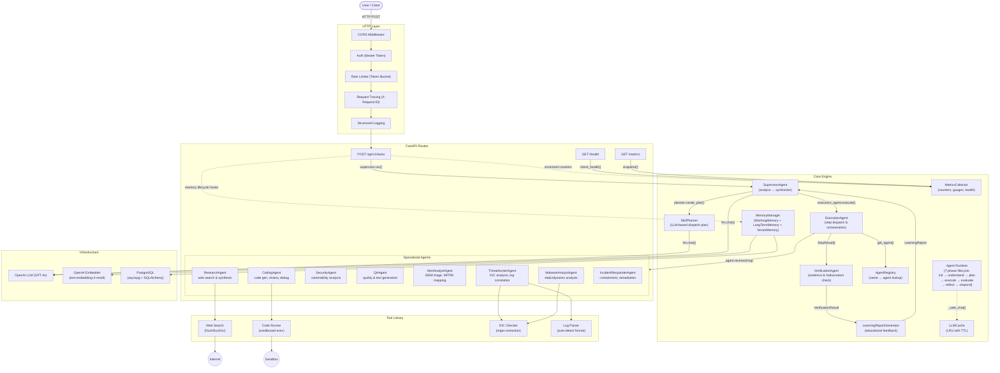

# Agent Harness — Architecture

## Project Overview

A production-ready multi-agent orchestration framework. Users submit natural-language requests via a REST API; the system decomposes them into sub-tasks, dispatches them to specialized AI agents, and synthesises a final response.

**Stack:** Python 3.12, FastAPI, PostgreSQL (asyncpg + SQLAlchemy), OpenAI LLM, numpy (vector search).

**Design principles:**
- Clean Architecture — each layer depends on abstractions, not concretions
- Inter-agent communication via typed `AgentMessage` protocol
- Three-tier memory (Working/LongTerm/Vector) with a `MemoryManager` facade
- Pluggable tools behind a `BaseTool` ABC with auto-selection
- Production hardening: Bearer auth, rate limiting, input validation, CORS, structured logging, metrics, health checks, LLM response cache

---

## Architecture Diagram



---

## Folder Structure

```
agent_harness/
├── agents/              Specialized agent implementations
│   ├── supervisor.py    Central coordinator
│   ├── registry.py      Agent name → instance lookup
│   ├── researcher.py    Web research & synthesis
│   ├── coder.py         Code generation & testing
│   ├── security.py      Vulnerability analysis
│   ├── qa.py            Quality assurance
│   ├── alert_analyst.py SIEM alert triage (SOC)
│   ├── threat_hunter.py Proactive threat hunting (SOC)
│   ├── malware_analyst.py  Malware static/dynamic analysis (SOC)
│   ├── incident_responder.py  Incident response & containment (SOC)
│   └── verifier.py       VerificationAgent (evidence, flag format, hallucination checks)
│
├── api/                 FastAPI HTTP entry point
│   └── main.py          Routes, middleware wiring, auth, health, metrics
│
├── config/              Configuration
│   └── settings.py      Pydantic-settings (env vars, .env)
│
├── core/                Engine layer
│   ├── agent.py         Agent runtime (7-phase lifecycle, auto tool selection)
│   ├── specialized.py   SpecializedAgent base class with messaging
│   ├── protocol.py      AgentMessage dataclass (inter-agent protocol)
│   ├── memory.py        Three-tier memory (Working, LongTerm, Vector) + MemoryManager
│   ├── cache.py         LLM response cache (LRU + TTL)
│   ├── security.py      API key auth, rate limiter, input validation, CORS, audit logging
│   ├── middleware.py    Request tracing, structured logging, error handling
│   ├── monitoring.py    Metrics collector, deep health checks
│   ├── orchestrator.py  Legacy orchestrator (backward compatibility)
│   └── planner.py       TaskPlanner (legacy)
│
├── database/            Persistence layer
│   ├── connection.py    Async SQLAlchemy engine + session factory
│   └── models.py        ORM models: TaskMemory, SolutionMemory, UserPreference, KnowledgeEntry
│
├── models/              Abstract interfaces
│   ├── llm.py           LLM base class + OpenAILLM implementation
│   └── embeddings.py    Embedder base class + OpenAIEmbedder implementation
│
├── soc/                 SOC domain objects
│   ├── frameworks.py    MITRE ATT&CK (25 techniques), Cyber Kill Chain, NIST CSF, port mapping
│   └── models.py        Dataclasses: Alert, IOC, LogEntry, Finding, Incident
│
    ├── tools/               Tool library
    │   ├── base.py          BaseTool ABC (name, description, parameters, execute)
    │   ├── registry.py      ToolRegistry (BaseTool instances)
    │   ├── web_search.py    DuckDuckGo HTML search
    │   ├── code_runner.py   Sandboxed Python execution
    │   ├── ioc_check.py     IOC extraction via regex (IPs, hashes, domains, URLs, registry, mutexes)
    │   ├── log_parser.py    Multi-format log parser (syslog, Apache, JSON, key=value)
    │   └── execution/       CTF Tool Execution Framework (Phase 3.3)
    │       ├── registry.py      ToolDefinitionRegistry (YAML-backed tool discovery)
    │       ├── selector.py      ToolSelector (keyword + capability ranking)
    │       ├── executor.py      ToolExecutor (sandboxed subprocess with timeout + audit)
    │       ├── policy.py        ExecutionPolicy (allowlist + dangerous pattern blocking)
    │       └── definitions/     Tool metadata YAML files
    │           ├── registry.yaml
    │           ├── file_analysis/tool.yaml   (file, strings, exiftool)
    │           ├── malware/tool.yaml         (yara, capa)
    │           ├── steganography/tool.yaml   (binwalk)
    │           ├── web/tool.yaml             (curl)
    │           └── general/tool.yaml         (python)
│
├── learning/             Educational feedback layer
│   └── report.py         LearningReportGenerator + LearningReport model
│   ├── file_tool.py     File read/write tool
│   ├── filesystem.py    Directory listing tool
│   └── database_tool.py SQL query tool
│
├── challenges_engine/   Challenge Orchestration & Evaluation (Phase 3.4)
│   ├── models.py        ChallengeDefinition pydantic model
│   ├── loader.py        ChallengeLoader (YAML discover, load, validate)
│   ├── registry.py      ChallengeRegistry (register, search, filter by category/difficulty/skill)
│   ├── validator.py     ChallengeValidator (metadata, skills, tools, files)
│   └── verifier.py      FlagVerifier (exact, regex, evidence matching)
│
├── challenges/           CTF challenge packages with structured metadata
│   ├── stego_basic_001/      challenge.yaml + files + hints
│   ├── malware_basic_001/    Malware analysis challenge
│   ├── crypto_basic_001/     Cryptography challenge
│   ├── web_basic_001/        Web security challenge
│   ├── forensics_basic_001/  Digital forensics challenge
│   ├── challenge01_hidden_message/  (legacy)
│   ├── challenge02_pcap_analysis/   (legacy)
│   └── ... (3 more legacy challenges)
│
├── skills_engine/       CTF skill system (Phase 1-2)
│   ├── schema.py        SkillFrontmatter, TokenBudget, FrameworkMapping, SkillMetadata
│   ├── loader.py        SkillLoader (discover, load, build_index, write_index)
│   ├── registry.py      SkillRegistry (register, search, filter)
│   ├── selector.py      SkillSelector (keyword + vector skill matching)
│   ├── injector.py      SkillInjector (prompt enrichment with token budget)
│   ├── planner.py       SkillPlanner + TaskPlan/PlanStep Pydantic models
│   ├── execution.py     ExecutionAgent + ExecutionResult/StepResult/ExecutionStatus
│   └── validator.py     SkillValidator (frontmatter, cross-ref, tool whitelist)
│
├── skills/              Skill content files (SKILL.md + YAML frontmatter)
│   ├── categories.yaml  Single source of truth for category taxonomy
│   ├── index.json       Auto-generated registry (fast scan entry point)
│   ├── solve-challenge/ Master orchestrator skill (user-invocable)
│   ├── ctf-web/         Web exploitation techniques
│   ├── ctf-forensics/   Digital forensics techniques (PCAP, stego, metadata)
│   └── ctf-reverse/     Reverse engineering techniques (ELF, Java, strings)
│
├── scripts/             Build and validation tooling
│   ├── build_index.py   CLI: scan skills/ → validate → generate index.json
│   └── validate_all_skills.py  CLI: bulk validation with optional security audit
│
├── workflows/           Predefined multi-agent workflows
│   ├── soc_incident_response.py  End-to-end SOC workflow
│   └── security_audit.py         Security audit workflow
│
├── tests/               19 test files, 471 tests
│   ├── test_agent_runtime.py     Agent lifecycle, auto tool selection
│   ├── test_memory.py           Working/Vector/MemoryManager, LongTermMemory ORM
│   ├── test_soc_agents.py       SOC frameworks, models, tools, agents, workflow
│   └── ... (10 more files)
│
├── Dockerfile           Multi-stage build (production + development targets)
├── docker-compose.yml   API + PostgreSQL 16 with health checks
├── requirements.txt     Python dependencies
└── .env.example         Environment variable template
```

---

## Workflow Explanation

### API Request Flow

```
HTTP POST /api/v1/tasks
  │
  ├── CORS Middleware         — validate Origin header
  ├── Auth Middleware         — verify Bearer token (SHA-256 hashed)
  ├── Rate Limiter            — token bucket per client
  ├── Request Tracing         — generate X-Request-ID
  ├── Structured Logging      — log request metadata
  │
  ├── validate_input()        — length check, prompt-injection patterns
  │
  └── supervisor.run(request)
        │
        ├── Phase 1: Analyse & Plan
        │     SkillPlanner.create_plan() — LLM generates TaskPlan
        │     with typed PlanStep[]: {agent, task, depends_on[]}
        │
        ├── Phase 2: Execute Plan
        │     Supervisor delegates to ExecutionAgent.execute(plan)
        │       For each step in dependency order:
        │         1. Look up agent in AgentRegistry
        │         2. Select & inject relevant skills (SkillSelector)
        │         3. Select & execute relevant tools (ToolSelector → ToolExecutor)
        │            [optional — only when tool_selector + tool_executor are wired]
        │         4. Append tool execution evidence to agent task
        │         5. Dispatch via agent.receive(AgentMessage)
        │         6. Agent processes task via process_task()
        │         7. Collect results with retry on failure
        │         8. Return structured ExecutionResult
        │     Supervisor converts to legacy dicts for synthesis
        │
        ├── Phase 3: Verify Results
        │     VerificationAgent reviews each step result:
        │       • Flag format detection (flag{...}, FLAG{...}, CTF{...})
        │       • Empty/minimal response check (< 20 chars → warning)
        │       • Evidence/reasoning marker presence
        │       • Unsupported/uncertain language detection
        │       • Failed execution identification
        │     Produces VerificationResult with:
        │       • Overall status (passed / failed / needs_review)
        │       • Confidence score (0.0–1.0)
        │       • Structured findings with severity
        │       • Recommendations
        │
        ├── Phase 4: Generate Learning Report
        │     LearningReportGenerator analyses:
        │       • Skills selected by SkillSelector during execution
        │       • VerificationResult (confidence, findings)
        │       • Agent result quality (failed/successful steps)
        │     Produces LearningReport with:
        │       • Challenge ID (deterministic hash of request)
        │       • Skills mastered vs. needing improvement
        │       • Learning objectives per skill category
        │       • Difficulty estimate (beginner/intermediate/advanced)
        │       • Student Report (formatted: what was learned, skills practiced, suggestions)
        │       • Instructor Summary (formatted: performance indicators, skill gaps, training)
        │     Fully deterministic (no LLM calls)
        │
        ├── Phase 4.5: Flag Verification (optional)
        │     When challenge_loader + flag_verifier are wired and a
        │     challenge_id is provided, run FlagVerifier.verify() against
        │     agent responses and tool outputs:
        │       • exact_flag — exact string comparison
        │       • regex — flag_format pattern + expected match
        │       • evidence — scan tool output + agent response
        │     Produces {status, method, detail, student_flag} in result
        │
        └── Phase 5: Synthesise
              Supervisor._synthesize() — LLM receives verification results,
              flag verification result, challenge info, and learning report
              alongside agent outputs → produces final response with
              awareness of confidence, flagged issues, and educational context
```

### Agent Internal Lifecycle

The `Agent` runtime class (`core/agent.py`) provides a 7-phase lifecycle used by the standalone runtime (not used by the Supervisor, which delegates to `SpecializedAgent.receive()`):

```
initialize(task)
    ↓
understand_task()       — LLM extracts goal & success criteria
    ↓
create_plan()           — LLM decomposes goal into steps
    ↓
execute_plan()          — per step: auto-select tool or reasoning
    ↓                         (via LLM tool-selection prompt)
evaluate_result()       — check success count vs total steps
    ↓
reflect()               — LLM analyses what worked, what didn't
    ↓
respond()               — LLM synthesises final answer
```

### Memory Workflow

```
on_new_task(task)
  ├── Set current task in WorkingMemory
  ├── Search VectorMemory for similar past tasks
  ├── Search LongTermMemory for related knowledge
  ├── Retrieve user preferences
  └── Append relevant context to agent prompt (via retrieve_context)

on_task_complete(task, result, success)
  ├── Add result to Agent Conversation in WorkingMemory
  ├── Save to LongTermMemory (TaskMemory + SolutionMemory)
  ├── If user preference detected → save UserPreference
  ├── If general knowledge → save KnowledgeEntry
  └── Store embedding in VectorMemory for future retrieval
```

### SOC Incident Response Workflow

A predefined multi-agent workflow (`workflows/soc_incident_response.py`):

```
Alert Data
    ↓
AlertAnalystAgent — triage, severity, MITRE mapping
    ↓
ThreatHunterAgent — IOC extraction, log correlation, hypothesis
    ↓
MalwareAnalystAgent — static/dynamic analysis, sandbox interpretation
    ↓
IncidentResponderAgent — timeline, containment, eradication, NIST CSF
    ↓
Synthesis — combined report
```

---

## Agent Descriptions

| Agent | Type | Purpose | Tools | Communicates With |
|-------|------|---------|-------|-------------------|
| **SupervisorAgent** | Coordinator | Analyse requests, delegate execution, synthesise results | LLM only | ExecutionAgent, LLM |
| **ExecutionAgent** | Coordinator | Execute plan steps, select skills, dispatch to specialists, retry on failure | SkillSelector, AgentRegistry | All 8 agents, SkillSelector |
| **VerificationAgent** | Framework | Review agent outputs for evidence quality, flag format, hallucination, completeness | None (stateless rules) | Supervisor (receives results) |
| **LearningReportGenerator** | Framework | Generate educational feedback reports from execution and verification results | None (deterministic) | Supervisor (receives results) |
| **ResearchAgent** | Specialist | Web research & structured reporting | `web_search` | Supervisor |
| **CodingAgent** | Specialist | Code generation, review, debugging, block execution | `code_runner` | Supervisor |
| **SecurityAgent** | Specialist | Vulnerability analysis, OWASP/CWE, remediation | None (LLM) | Supervisor |
| **QAAgent** | Specialist | Code quality scoring, test generation, edge cases | None (LLM) | Supervisor |
| **AlertAnalystAgent** | SOC | SIEM triage, severity, MITRE mapping, investigation steps | None (LLM + frameworks) | Supervisor |
| **ThreatHunterAgent** | SOC | IOC analysis, log correlation, behavioural detection | `ioc_check`, `log_parser` | Supervisor, AlertAnalyst |
| **MalwareAnalystAgent** | SOC | Static/dynamic analysis, sandbox interpretation | `ioc_check` | Supervisor, ThreatHunter |
| **IncidentResponderAgent** | SOC | Timeline, containment, eradication, NIST CSF | None (LLM + frameworks) | Supervisor, all SOC |

### Agent Communication Protocol

All inter-agent communication uses `AgentMessage` (`core/protocol.py`):

```python
@dataclass
class AgentMessage:
    sender: str            # e.g. "supervisor"
    receiver: str          # e.g. "researcher"
    task: str              # the instruction
    response: str          # populated on reply
    status: str            # "pending" | "completed" | "failed"
    timestamp: str         # ISO-8601
    conversation_id: str   # correlates related messages
    metadata: dict | None  # extra context (token usage, errors)
```

Agents never import each other directly. The Supervisor discovers agents by name via the `AgentRegistry` and communicates exclusively through `AgentMessage` objects.

---

## Key Design Decisions

1. **Supervisor as single entry point** — All requests flow through one coordinator, simplifying auth, logging, and error handling. The Supervisor never imports agents directly; it uses the Registry for loose coupling.

2. **SpecializedAgent base** — Every agent inherits from `core/specialized.py`, which provides `receive()` → `process_task()` → reply pattern and backward-compatible `execute()` for the legacy orchestrator.

3. **Three-tier memory** — Working (ephemeral, in-memory), LongTerm (PostgreSQL ORM with 4 models), Vector (numpy cosine similarity). The `MemoryManager` facade coordinates all three.

4. **Auto tool selection** — When a plan step doesn't specify a tool, the Agent runtime asks the LLM to choose the best tool via `TOOL_SELECTION_PROMPT`, making the system extensible without code changes.

5. **LLM response cache** — Deterministic responses (temperature=0) are cached by (model, messages, temperature) hash with configurable TTL, reducing cost and latency.

6. **Production middleware stack** — Auth → Rate Limit → Tracing → Logging are layered as FastAPI middleware, keeping route handlers clean and consistent.

7. **SkillPlanner + ExecutionAgent decomposition** — The original monolithic SupervisorAgent was decomposed into three responsibilities: (a) **SkillPlanner** generates typed `TaskPlan`/`PlanStep` models via LLM, (b) **ExecutionAgent** executes those steps with dependency ordering, skill injection, and retry logic, (c) **SupervisorAgent** remains as the top-level coordinator that wires the two and synthesises the final response. This follows the Single Responsibility Principle and makes each component independently testable.

8. **Structured execution results** — `ExecutionResult`/`StepResult`/`ExecutionStatus` models replace raw dicts from the execution loop. `StepResult` tracks attempts, error messages, and agent responses. `ExecutionResult.to_legacy_dicts()` provides backward compatibility for the synthesis phase.

9. **Verification as a stateless gate** — `VerificationAgent` (`agents/verifier.py`) is a purely stateless rule engine that reviews agent outputs without an LLM or external services. It performs:
   - **Flag format detection** via regex for `flag{...}`, `FLAG{...}`, `CTF{...}` patterns
   - **Evidence quality** by scanning for reasoning marker phrases ("because", "evidence shows", "based on")
   - **Completeness** by detecting empty or minimal responses (< 20 characters)
   - **Hallucination risk** by flagging uncertain language ("I think", "probably", "might be")
   - **Execution failure** tracking from step status
   
   Confidence scoring starts at 1.0 and deducts for each issue (empty: -0.3, failure: -0.25, minimal: -0.15, missing evidence: -0.1, unsupported claims: -0.1). Flag presence adds up to +0.15. The score determines the final status (PASSED ≥ 0.8, NEEDS_REVIEW ≥ 0.6, FAILED below).

10. **Four-phase supervisor pipeline** — The original monolithic Supervisor has been decomposed into Plan (SkillPlanner) → Execute (ExecutionAgent) → Verify (VerificationAgent) → Learn (LearningReportGenerator) → Synthesise (Supervisor). Each phase produces typed models consumed by the next, making the pipeline independently testable and auditable.

11. **Deterministic learning reports** — `LearningReportGenerator` (`learning/report.py`) uses zero LLM calls. It analyses execution skills, verification findings, and step status through rule-based classification:
    - **Skill classification**: With flag present and confidence >= 0.7 → mastered; with errors or confidence < 0.5 → needing improvement
    - **Difficulty estimation**: Based on step count (1-2 → beginner, 3-4 → intermediate, 5+ → advanced) and confidence score
    - **Learning objectives**: Category-based templates (e.g., "Understand and apply {skill} techniques for web-based challenges")
    - **Two report formats**: Student Report (learner-facing: skills practiced, objectives, suggestions) and Instructor Summary (educator-facing: performance indicators, skill gaps, training recommendations)

12. **Controlled tool execution framework** — `ToolDefinitionRegistry` (`tools/execution/registry.py`) discovers tools from YAML metadata files, `ToolSelector` (`tools/execution/selector.py`) ranks them by keyword/capability/skill relevance, `ExecutionPolicy` (`tools/execution/policy.py`) enforces a tool allowlist and dangerous-command pattern blocking, and `ToolExecutor` (`tools/execution/executor.py`) runs approved tools via subprocess with configurable timeouts and full audit logging. Integration into `ExecutionAgent` is optional and backward-compatible — when `tool_selector` and `tool_executor` are wired, tool evidence is automatically appended to each agent task before dispatch. All execution results (SUCCESS / FAILED / TIMEOUT / BLOCKED / TOOL_NOT_FOUND) are recorded in an execution log with timestamps and duration.
