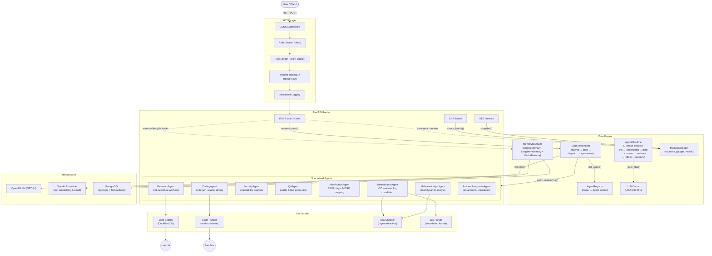

# Agent Harness — Architecture

## Project Overview

A production-ready multi-agent orchestration framework. Users submit natural-language requests via a REST API; the system decomposes them into sub-tasks, dispatches them to specialized AI agents, and synthesises a final response.

**Stack:** Python 3.12, FastAPI, PostgreSQL (asyncpg + SQLAlchemy), OpenAI LLM, numpy (vector search).

**Design principles:**
- Clean Architecture — each layer depends on abstractions, not concretions
- Inter-agent communication via typed `AgentMessage` protocol
- Three-tier memory (Working/LongTerm/Vector) with a `MemoryManager` facade
- Pluggable tools behind a `BaseTool` ABC with auto-selection
- Production hardening: Bearer auth, rate limiting, input validation, CORS, structured logging, metrics, health checks, LLM response cache

---

## Architecture Diagram



---

## Folder Structure

```
agent_harness/
├── agents/              Specialized agent implementations
│   ├── supervisor.py    Central coordinator
│   ├── registry.py      Agent name → instance lookup
│   ├── researcher.py    Web research & synthesis
│   ├── coder.py         Code generation & testing
│   ├── security.py      Vulnerability analysis
│   ├── qa.py            Quality assurance
│   ├── alert_analyst.py SIEM alert triage (SOC)
│   ├── threat_hunter.py Proactive threat hunting (SOC)
│   ├── malware_analyst.py  Malware static/dynamic analysis (SOC)
│   └── incident_responder.py  Incident response & containment (SOC)
│
├── api/                 FastAPI HTTP entry point
│   └── main.py          Routes, middleware wiring, auth, health, metrics
│
├── config/              Configuration
│   └── settings.py      Pydantic-settings (env vars, .env)
│
├── core/                Engine layer
│   ├── agent.py         Agent runtime (7-phase lifecycle, auto tool selection)
│   ├── specialized.py   SpecializedAgent base class with messaging
│   ├── protocol.py      AgentMessage dataclass (inter-agent protocol)
│   ├── memory.py        Three-tier memory (Working, LongTerm, Vector) + MemoryManager
│   ├── cache.py         LLM response cache (LRU + TTL)
│   ├── security.py      API key auth, rate limiter, input validation, CORS, audit logging
│   ├── middleware.py    Request tracing, structured logging, error handling
│   ├── monitoring.py    Metrics collector, deep health checks
│   ├── orchestrator.py  Legacy orchestrator (backward compatibility)
│   └── planner.py       TaskPlanner (legacy)
│
├── database/            Persistence layer
│   ├── connection.py    Async SQLAlchemy engine + session factory
│   └── models.py        ORM models: TaskMemory, SolutionMemory, UserPreference, KnowledgeEntry
│
├── models/              Abstract interfaces
│   ├── llm.py           LLM base class + OpenAILLM implementation
│   └── embeddings.py    Embedder base class + OpenAIEmbedder implementation
│
├── soc/                 SOC domain objects
│   ├── frameworks.py    MITRE ATT&CK (25 techniques), Cyber Kill Chain, NIST CSF, port mapping
│   └── models.py        Dataclasses: Alert, IOC, LogEntry, Finding, Incident
│
├── tools/               Tool library
│   ├── base.py          BaseTool ABC (name, description, parameters, execute)
│   ├── registry.py      ToolRegistry
│   ├── web_search.py    DuckDuckGo HTML search
│   ├── code_runner.py   Sandboxed Python execution
│   ├── ioc_check.py     IOC extraction via regex (IPs, hashes, domains, URLs, registry, mutexes)
│   ├── log_parser.py    Multi-format log parser (syslog, Apache, JSON, key=value)
│   ├── file_tool.py     File read/write tool
│   ├── filesystem.py    Directory listing tool
│   └── database_tool.py SQL query tool
│
├── workflows/           Predefined multi-agent workflows
│   ├── soc_incident_response.py  End-to-end SOC workflow
│   └── security_audit.py         Security audit workflow
│
├── tests/               13 test files, 147 tests
│   ├── test_agent_runtime.py     Agent lifecycle, auto tool selection
│   ├── test_memory.py           Working/Vector/MemoryManager, LongTermMemory ORM
│   ├── test_soc_agents.py       SOC frameworks, models, tools, agents, workflow
│   └── ... (10 more files)
│
├── Dockerfile           Multi-stage build (production + development targets)
├── docker-compose.yml   API + PostgreSQL 16 with health checks
├── requirements.txt     Python dependencies
└── .env.example         Environment variable template
```

---

## Workflow Explanation

### API Request Flow

```
HTTP POST /api/v1/tasks
  │
  ├── CORS Middleware         — validate Origin header
  ├── Auth Middleware         — verify Bearer token (SHA-256 hashed)
  ├── Rate Limiter            — token bucket per client
  ├── Request Tracing         — generate X-Request-ID
  ├── Structured Logging      — log request metadata
  │
  ├── validate_input()        — length check, prompt-injection patterns
  │
  └── supervisor.run(request)
        │
        ├── Phase 1: Analyse & Plan
        │     LLM receives available agents → returns JSON dispatch plan
        │     with steps: {agent, task, depends_on[]}
        │
        ├── Phase 2: Execute Plan
        │     For each step in dependency order:
        │       1. Look up agent in AgentRegistry
        │       2. Create AgentMessage(sender="supervisor", receiver=agent_name)
        │       3. Call agent.receive(message)
        │       4. Agent processes task via process_task() → LLM + Tools
        │       5. Agent returns reply AgentMessage with response
        │       6. Record in conversation_history
        │
        └── Phase 3: Synthesise
              LLM receives all agent results → produces final response
```

### Agent Internal Lifecycle

The `Agent` runtime class (`core/agent.py`) provides a 7-phase lifecycle used by the standalone runtime (not used by the Supervisor, which delegates to `SpecializedAgent.receive()`):

```
initialize(task)
    ↓
understand_task()       — LLM extracts goal & success criteria
    ↓
create_plan()           — LLM decomposes goal into steps
    ↓
execute_plan()          — per step: auto-select tool or reasoning
    ↓                         (via LLM tool-selection prompt)
evaluate_result()       — check success count vs total steps
    ↓
reflect()               — LLM analyses what worked, what didn't
    ↓
respond()               — LLM synthesises final answer
```

### Memory Workflow

```
on_new_task(task)
  ├── Set current task in WorkingMemory
  ├── Search VectorMemory for similar past tasks
  ├── Search LongTermMemory for related knowledge
  ├── Retrieve user preferences
  └── Append relevant context to agent prompt (via retrieve_context)

on_task_complete(task, result, success)
  ├── Add result to Agent Conversation in WorkingMemory
  ├── Save to LongTermMemory (TaskMemory + SolutionMemory)
  ├── If user preference detected → save UserPreference
  ├── If general knowledge → save KnowledgeEntry
  └── Store embedding in VectorMemory for future retrieval
```

### SOC Incident Response Workflow

A predefined multi-agent workflow (`workflows/soc_incident_response.py`):

```
Alert Data
    ↓
AlertAnalystAgent — triage, severity, MITRE mapping
    ↓
ThreatHunterAgent — IOC extraction, log correlation, hypothesis
    ↓
MalwareAnalystAgent — static/dynamic analysis, sandbox interpretation
    ↓
IncidentResponderAgent — timeline, containment, eradication, NIST CSF
    ↓
Synthesis — combined report
```

---

## Agent Descriptions

| Agent | Type | Purpose | Tools | Communicates With |
|-------|------|---------|-------|-------------------|
| **SupervisorAgent** | Coordinator | Analyse requests, dispatch to specialists, synthesise results | LLM only | All 8 agents |
| **ResearchAgent** | Specialist | Web research & structured reporting | `web_search` | Supervisor |
| **CodingAgent** | Specialist | Code generation, review, debugging, block execution | `code_runner` | Supervisor |
| **SecurityAgent** | Specialist | Vulnerability analysis, OWASP/CWE, remediation | None (LLM) | Supervisor |
| **QAAgent** | Specialist | Code quality scoring, test generation, edge cases | None (LLM) | Supervisor |
| **AlertAnalystAgent** | SOC | SIEM triage, severity, MITRE mapping, investigation steps | None (LLM + frameworks) | Supervisor |
| **ThreatHunterAgent** | SOC | IOC analysis, log correlation, behavioural detection | `ioc_check`, `log_parser` | Supervisor, AlertAnalyst |
| **MalwareAnalystAgent** | SOC | Static/dynamic analysis, sandbox interpretation | `ioc_check` | Supervisor, ThreatHunter |
| **IncidentResponderAgent** | SOC | Timeline, containment, eradication, NIST CSF | None (LLM + frameworks) | Supervisor, all SOC |

### Agent Communication Protocol

All inter-agent communication uses `AgentMessage` (`core/protocol.py`):

```python
@dataclass
class AgentMessage:
    sender: str            # e.g. "supervisor"
    receiver: str          # e.g. "researcher"
    task: str              # the instruction
    response: str          # populated on reply
    status: str            # "pending" | "completed" | "failed"
    timestamp: str         # ISO-8601
    conversation_id: str   # correlates related messages
    metadata: dict | None  # extra context (token usage, errors)
```

Agents never import each other directly. The Supervisor discovers agents by name via the `AgentRegistry` and communicates exclusively through `AgentMessage` objects.

---

## Key Design Decisions

1. **Supervisor as single entry point** — All requests flow through one coordinator, simplifying auth, logging, and error handling. The Supervisor never imports agents directly; it uses the Registry for loose coupling.

2. **SpecializedAgent base** — Every agent inherits from `core/specialized.py`, which provides `receive()` → `process_task()` → reply pattern and backward-compatible `execute()` for the legacy orchestrator.

3. **Three-tier memory** — Working (ephemeral, in-memory), LongTerm (PostgreSQL ORM with 4 models), Vector (numpy cosine similarity). The `MemoryManager` facade coordinates all three.

4. **Auto tool selection** — When a plan step doesn't specify a tool, the Agent runtime asks the LLM to choose the best tool via `TOOL_SELECTION_PROMPT`, making the system extensible without code changes.

5. **LLM response cache** — Deterministic responses (temperature=0) are cached by (model, messages, temperature) hash with configurable TTL, reducing cost and latency.

6. **Production middleware stack** — Auth → Rate Limit → Tracing → Logging are layered as FastAPI middleware, keeping route handlers clean and consistent.
