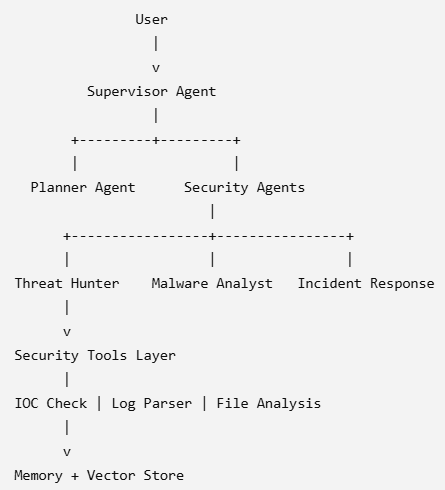

# 🤖 Agentic AI Security Harness

A Multi-Agent AI Framework for Cybersecurity Learning, SOC Automation Research, and CTF Security Analysis.


---

## Overview

The **Agentic AI Security Harness** is a learning and research project that explores how **Agentic AI systems** can be designed and applied to cybersecurity scenarios.

The project focuses on building a multi-agent framework where AI agents can collaborate to perform cybersecurity-related tasks, including:

* Security analysis
* Threat investigation
* SOC workflow automation
* Evidence collection
* CTF challenge analysis
* Cybersecurity learning exercises

The goal is to provide a practical environment for students, researchers, and cybersecurity enthusiasts to understand how AI agents can support security operations and problem-solving workflows.

---

# Why This Project Exists

Traditional cybersecurity operations often require analysts to perform repetitive tasks such as:

* Collecting information from multiple sources
* Reviewing security evidence
* Investigating suspicious activities
* Documenting findings
* Preparing incident reports

This project explores how **Agentic AI workflows** can assist cybersecurity analysts by combining:

* Planning agents
* Execution agents
* Analysis agents
* Review agents

to improve investigation efficiency and provide an educational platform for cybersecurity experimentation.

---

# Target Users

This project is primarily designed for:

* Cybersecurity students
* Students learning Artificial Intelligence and cybersecurity
* Beginner security analysts
* Researchers exploring AI-assisted cybersecurity workflows
* Participants preparing for Capture The Flag (CTF) competitions

The project provides hands-on experience with:

* Multi-agent architecture
* AI-assisted security investigation
* Security automation concepts
* CTF challenge solving workflows

---

# Defensive Security Purpose

The Agentic AI Security Harness is designed for **cybersecurity education, research, and authorized security testing environments**.

The framework explores how AI agents can assist with Tier-1 Security Operations Center (SOC) activities, including:

* Initial security triage
* Information gathering
* Evidence analysis
* Investigation assistance
* Workflow automation
* Report generation

This project is currently in an early development stage and requires further enhancement, testing, and validation before being considered suitable for real-world SOC operational deployment.

---

# Architecture

The Agentic AI Security Harness follows a multi-agent architecture designed for cybersecurity analysis and automation.

High-level workflow:

```
User Input
    ↓
Orchestrator
    ↓
Planner Agent
    ↓
Executor Agents
    ↓
Reviewer Agent
    ↓
Final Response
```

The architecture follows a **planning-execution-review pattern**, where specialized AI agents collaborate to complete cybersecurity analysis tasks.

## Security Architecture



Updated as of 2026-07-31:


---

# System Components

The project is organized into several layers:

```
agent_harness/

├── agents/          # Specialized AI agent implementations
├── api/             # FastAPI HTTP interface
├── challenges/      # CTF challenge scenarios and security exercises
├── solutions/       # AI-generated investigation artifacts
├── tools/           # Security analysis capabilities
├── models/          # LLM and embedding interfaces
├── database/        # Data persistence layer
├── config/          # Environment and runtime configuration
└── README.md
```

## Component Description

| Folder        | Purpose                                                               |
| ------------- | --------------------------------------------------------------------- |
| `api/`        | Provides API entry points for interacting with the system             |
| `core/`       | Contains orchestration engine and agent lifecycle management          |
| `agents/`     | Contains specialized AI security agents                               |
| `tools/`      | Provides supporting capabilities such as file analysis and automation |
| `models/`     | Handles AI model and embedding interfaces                             |
| `database/`   | Stores application data and persistence information                   |
| `config/`     | Manages system configuration                                          |
| `challenges/` | Contains CTF scenarios and security exercises                         |
| `solutions/`  | Stores AI-generated analysis scripts and investigation outputs        |

---

# Agentic AI CTF Workflow

The Agentic AI Security Harness can be used to explore AI-assisted Capture The Flag (CTF) security analysis.

Workflow:

```
Challenge Input
        ↓
AI Agent Planning
        ↓
Security Investigation
        ↓
Evidence Collection
        ↓
Technical Analysis
        ↓
Solution Report Generation
        ↓
Flag Submission
```

Example challenge categories:

* Information disclosure
* Log analysis
* Network traffic analysis
* Binary analysis
* Malware investigation
* Web security analysis

---

# CTF Challenge Structure

Example:

```
challenges/

├── challenge01_hidden_message/
│   └── easy01_hidden_message.txt
│
├── challenge02_pcap_analysis/
│   └── capture.pcapng
│
└── challenge03_binary_reverse/
    ├── authorize
    └── binary1
```

Challenge files represent the original materials provided to the AI agent or participants.

---

# AI Solution Artifacts

During AI-assisted investigation, the system may generate:

* Analysis scripts
* Reverse engineering utilities
* Investigation notes
* Extracted evidence
* Security reports

Example:

```
solutions/

└── challenge03_binary_reverse/

    ├── analyze_binary1.py
    ├── analyze_elf.py
    ├── disasm.py
    └── solve_binary1.py
```

These artifacts demonstrate the investigation process performed during CTF analysis.

---

# Quick Start

## 1. Clone Repository

```bash
git clone <repository-url>

cd agent_harness
```

## 2. Configure Environment

```bash
cp .env.example .env
```

Update required environment variables.

## 3. Install Dependencies

```bash
pip install -r requirements.txt
```

## 4. Start Application

```bash
uvicorn api.main:app --reload
```

---

# Development Status

Current development focus:

✅ Multi-agent cybersecurity workflow
✅ AI-assisted CTF analysis
✅ Security investigation automation
✅ Challenge organization framework
✅ Educational cybersecurity scenarios

Future improvements:

* Additional security agents
* More CTF scenarios
* Improved automation workflows
* Enhanced reporting capability
* Integration with cybersecurity tools

---

# Responsible Use

This project is intended for:

* Cybersecurity education
* Research
* CTF competitions
* Authorized security testing environments

Users should only analyze systems, files, and networks where they have appropriate authorization.

This project should not be used for:

* Unauthorized access
* Malicious activities
* Attacking systems without permission

---

# Agentic AI-Driven CTF Harness

An autonomous AI-powered cybersecurity CTF solving framework.

## License

MIT License

Copyright (c) 2026 Soo Weng Jyh


## Citation

If you use this project for research, education, academic work, or publications,
please cite this project:

Soo Weng Jyh (2026).
"Agentic AI-Driven CTF Harness: An Autonomous Multi-Agent Cybersecurity CTF Framework."
GitHub repository:
https://github.com/jyhtonix/agent_harness


## Acknowledgement

If this project contributes to your research, education activities,
or cybersecurity competitions, acknowledgement of this project and
its creator is appreciated.


