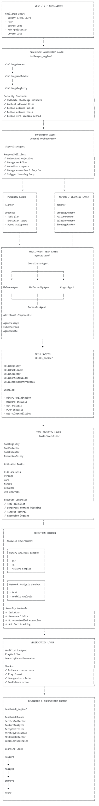

# 🤖 Agentic AI Security Harness

A Multi-Agent AI Framework for Cybersecurity Learning, SOC Automation Research, and CTF Security Analysis.


---

# Overview

The **Agentic AI Security Harness** is an educational and research-oriented **multi-agent AI cybersecurity framework** designed to explore how Agentic AI systems can assist cybersecurity analysis, security operations workflows, and Capture The Flag (CTF) problem-solving.

The project focuses on designing autonomous AI workflows where specialized agents collaborate to perform cybersecurity-related tasks:

* Security investigation
* Threat analysis
* Evidence collection
* CTF challenge analysis
* Reverse engineering assistance
* Malware analysis support
* Web security assessment
* Cybersecurity learning activities

The goal is to provide students, researchers, and cybersecurity practitioners with a practical platform to understand how AI agents can support security workflows.

---

# Project Motivation

Modern cybersecurity operations require analysts to perform many repetitive and time-consuming activities:

* Collecting investigation evidence
* Analysing suspicious files
* Reviewing logs
* Performing initial triage
* Documenting findings
* Creating investigation reports

This project explores how **Agentic AI workflows** can support cybersecurity analysts by combining:

* Planning agents
* Execution agents
* Specialist security agents
* Verification agents
* Learning and improvement mechanisms

The framework follows the concept of:

> Plan → Execute → Analyse → Verify → Improve

---

# Key Features

## Multi-Agent Cybersecurity Architecture

The framework includes specialised AI agents working together:

* Planner Agent

  * Breaks down security tasks
  * Creates investigation strategies

* Executor Agent

  * Executes approved tools and workflows

* Specialist Security Agents

  * Web Security Agent
  * Binary Reverse Engineering Agent
  * Malware Analysis Agent
  * Digital Forensics Agent
  * Cryptography Agent
  * Pwn Analysis Agent
  * DevOps Security Agent

* Reviewer / Verifier Agent

  * Validates findings
  * Improves investigation accuracy

---

## Agent Skill Registry System

The framework includes an extensible skill-based architecture.

Features:

* Dynamic skill discovery
* Specialist agent routing
* Security knowledge injection
* Skill validation
* Skill-based workflow planning

Example skill domains:

* Web exploitation
* Reverse engineering
* Malware analysis
* Digital forensics
* Cryptography
* CTF challenge solving

---

## Autonomous Learning and Improvement

The framework includes experimental learning capabilities:

* Agent performance tracking
* Investigation history
* Strategy evaluation
* Benchmark comparison
* Improvement feedback

The objective is to explore how AI security agents can gradually improve their problem-solving workflows.

---

## AI-Assisted CTF Security Analysis

The framework supports cybersecurity learning through CTF challenges.

Supported activities:

* Challenge understanding
* Evidence analysis
* Tool selection
* Investigation workflow planning
* Solution documentation

Example categories:

* Information disclosure
* Web security
* Binary reverse engineering
* Malware investigation
* Network analysis
* Cryptography

---

# Target Users

This project is designed for:

* Cybersecurity students
* Artificial Intelligence students
* Security researchers
* Beginner SOC analysts
* CTF participants
* Educators exploring AI-assisted cybersecurity learning

The project provides practical experience in:

* Multi-agent AI architecture
* Security automation
* AI-assisted investigation
* CTF solving methodology
* Cybersecurity workflow design

---

# Defensive Security Purpose

The Agentic AI Security Harness is designed for:

✅ Cybersecurity education
✅ Academic research
✅ CTF competitions
✅ Authorized security testing environments

The framework explores how AI agents can assist with:

* Security triage
* Evidence gathering
* Investigation assistance
* Workflow automation
* Report generation

This project is currently a research and educational framework.

Additional validation, testing, and security controls are required before considering operational SOC deployment.

---

# Architecture

The framework follows a multi-agent planning and execution architecture.

High-level workflow:

```
                 User Request
                      |
                      v
              Orchestrator Engine
                      |
                      v
               Planner Agent
                      |
        +-------------+-------------+
        |             |             |
        v             v             v

   Web Agent     Malware Agent   Binary Agent
   Crypto Agent  Forensics Agent Pwn Agent

        |
        v

        Security Tools Layer

        |
        v

     Verification Agent

        |
        v

     Final Investigation Report
```

---

## Security Architecture

Current architecture:


Updated as of 2026-07-31:




---

# System Structure

The project is organised into multiple layers:

```
agentic-ai-harness/

├── agents/                  # AI security agent implementations
├── api/                     # FastAPI application interface
├── core/                    # Agent orchestration and runtime engine
├── models/                  # LLM and embedding interfaces
├── tools/                   # Security analysis tools and execution framework
├── skills/                  # Agent skill definitions and routing
├── skill_packs/             # Cybersecurity domain knowledge packages
├── challenges/              # CTF challenges and security exercises
├── solutions/               # Investigation scripts and analysis artifacts
├── benchmark_engine/        # Agent evaluation and benchmarking
├── learning_engine/         # Autonomous learning components
├── database/                # Data storage and persistence layer
├── workflows/               # Security investigation workflows
├── tests/                   # Automated testing framework
├── docs/                    # Technical documentation
├── config/                  # Configuration management
├── prompts/                 # Specialist AI prompts
├── requirements.txt         # Python dependencies
└── README.md
```

---

# Component Overview

| Component           | Purpose                           |
| ------------------- | --------------------------------- |
| `agents/`           | AI cybersecurity agents           |
| `core/`             | Agent lifecycle and orchestration |
| `tools/`            | Security tool execution framework |
| `models/`           | LLM and embedding integration     |
| `skills/`           | Skill registry and routing system |
| `skill_packs/`      | Cybersecurity knowledge modules   |
| `challenges/`       | CTF learning scenarios            |
| `solutions/`        | Investigation outputs             |
| `benchmark_engine/` | Evaluation and comparison         |
| `learning_engine/`  | Improvement and feedback system   |
| `workflows/`        | Security workflow automation      |
| `tests/`            | Framework validation              |

---

# CTF Challenge Workflow

Example workflow:

```
CTF Challenge Input

        |
        v

AI Planning Agent

        |
        v

Security Investigation

        |
        v

Evidence Collection

        |
        v

Technical Analysis

        |
        v

Verification

        |
        v

Solution Report Generation
```

---

# Challenge Examples

Current challenge categories include:

```
challenges/

├── challenge01_hidden_message
├── challenge02_pcap_analysis
├── challenge03_binary_reverse
├── challenge04_StegoRSA
├── challenge05_reverse_eng
├── challenge06_binary_formatstring3
├── challenge07_binary_solfire
├── challenge08_web_SecretBox
├── challenge09_web_paper2
└── challenge12_web_liveArt
```

---

# Documentation

## Student Setup Guide

New users and students should read:

📘 [Student Setup Guide](STUDENT_SETUP_GUIDE.md)

The guide covers:

* Installing Python
* Creating virtual environment
* Installing dependencies
* Configuring environment variables
* Running the framework

---

## Technical Documentation

Available documentation:

* [Agent Skill Registry Architecture](docs/AGENT_SKILL_REGISTRY.md)
* [Autonomous Improvement Guide](docs/AUTONOMOUS_IMPROVEMENT_GUIDE.md)
* [CTF Benchmark Guide](docs/CTF_BENCHMARK_GUIDE.md)
* [Challenge Development Guide](docs/CHALLENGE_DEVELOPMENT_GUIDE.md)
* [Multi-Agent Guide](docs/MULTI_AGENT_GUIDE.md)

---

# Quick Start

## 1. Clone Repository

```bash
git clone https://github.com/jyhtonix/agentic-ai-harness.git

cd agentic-ai-harness
```

---

## 2. Create Virtual Environment

```bash
python -m venv .venv
```

Activate:

Windows:

```powershell
.venv\Scripts\activate
```

---

## 3. Install Dependencies

```bash
pip install -r requirements.txt
```

---

## 4. Configure Environment

Create:

```bash
.env
```

from:

```bash
.env.example
```

Configure required API keys.

---

## 5. Start Application

Recommended:

```powershell
python -m api.main
```

Alternative:

```bash
uvicorn api.main:app --reload
```

---

# Using the Harness to Solve CTF Challenges

The Agentic AI Security Harness can be used as an AI-assisted investigation platform for authorized CTF challenges.

The intended workflow is:

```text
CTF Challenge
     ↓
Submit Challenge Question
     ↓
Agent Harness API
     ↓
Supervisor Agent
     ↓
Planner Agent
     ↓
Specialist Security Agents
     ↓
Investigation / Tool Execution
     ↓
Evidence Analysis
     ↓
Reviewer / Final Analysis
     ↓
Suggested Solution / Flag
```

The harness is designed to help the participant **investigate and reason through a challenge**, rather than simply asking an LLM for an answer.

---

## 1. Configure the LLM Provider

Create a `.env` file in the project root.

Example:

```env
# LLM
OPENAI_API_KEY=your_openrouter_api_key
OPENAI_BASE_URL=https://openrouter.ai/api/v1
OPENAI_MODEL=deepseek/deepseek-v4-flash

LLM_TEMPERATURE=0.7
LLM_MAX_TOKENS=4096

# Embeddings
EMBEDDING_MODEL=text-embedding-3-small
EMBEDDING_DIMENSION=1536

# Database
DATABASE_URL=sqlite+aiosqlite:///./agent_harness.db

# Vector Store
VECTOR_STORE=memory

# Server
HOST=127.0.0.1
PORT=8001
```

> **Security:** Never commit `.env` or expose your API key in GitHub, screenshots, terminal recordings, or challenge write-ups.

The harness uses an OpenAI-compatible client, allowing compatible providers to be configured through `OPENAI_BASE_URL`.

---

## 2. Verify the Configuration

Before starting the server, verify that the application can load the configuration:

```powershell
python -c "from config.settings import settings; print('KEY:', 'SET' if settings.openai_api_key else 'NOT SET'); print('BASE:', settings.openai_base_url); print('MODEL:', settings.openai_model)"
```

Expected output:

```text
KEY: SET
BASE: https://openrouter.ai/api/v1
MODEL: deepseek/deepseek-v4-flash
```

Do not print or share the actual API key.

---

## 3. Start the Agent Harness

Activate the Python virtual environment:

```powershell
.\.venv\Scripts\Activate.ps1
```

Start the FastAPI server:

```powershell
uvicorn api.main:app --host 127.0.0.1 --port 8001 --reload
```

The server should report:

```text
INFO: Uvicorn running on http://127.0.0.1:8001
INFO: Application startup complete.
```

Keep this terminal running while submitting CTF challenges.

---

## 4. Submit a CTF Question

The main task endpoint is:

```text
POST /api/v1/tasks
```

A CTF challenge can be submitted as a task containing the challenge description, connection information, files, or other authorized challenge material.

For example, a challenge question might look like:

```text
The Wandering Order's spellbook service lets you inscribe,
rewrite, banish, and recite spells. A banished spell is
supposed to be gone. Is it really?

nc example.ctf.local 9005
```

The important part is to give the agent the **complete challenge description and relevant connection information**.

Avoid adding assumptions such as:

```text
I think this is a buffer overflow.
```

unless you have already established that through your own investigation.

A better submission is:

```text
Analyze this CTF challenge.

Challenge:
The Wandering Order's spellbook service lets you inscribe,
rewrite, banish, and recite spells. A banished spell is
supposed to be gone. Is it really?

Connection:
nc example.ctf.local 1234

Determine:
1. The challenge category.
2. How the service works.
3. What vulnerability or weakness is present.
4. How the weakness can be demonstrated in the authorized CTF environment.
5. The evidence supporting the conclusion.
6. The expected flag or solution if it can be determined.
```

---

## 5. Using a PowerShell CTF Runner

For repeatable testing, a PowerShell script can submit the challenge to the local API.

Example:

```powershell
$challenge = @"
Analyze this authorized CTF challenge.

The challenge description is:

[PASTE CTF QUESTION HERE]

Connection information:

[PASTE AUTHORIZED CTF CONNECTION HERE]

Investigate the challenge, identify the vulnerability,
perform the required analysis, and determine the flag if possible.
"@

$body = @{
    input = $challenge
} | ConvertTo-Json

Invoke-RestMethod `
    -Uri "http://127.0.0.1:8001/api/v1/tasks" `
    -Method POST `
    -ContentType "application/json" `
    -Body $body
```

The exact request schema may change as the API evolves. Check the FastAPI documentation or the API implementation if the endpoint parameters differ.

---

## 6. Example CTF Workflow

A typical investigation should follow this pattern:

### Step 1 — Classify

The Supervisor/Planner should determine the likely challenge category, for example:

```text
Web
Binary Reverse Engineering
Forensics
Cryptography
Pwn
Network
Malware Analysis
OSINT
```

### Step 2 — Plan

The Planner Agent creates an investigation plan.

For example:

```text
1. Understand the service interface.
2. Enumerate available operations.
3. Identify unusual application behaviour.
4. Collect evidence.
5. Determine the underlying vulnerability.
6. Validate the hypothesis.
7. Search for the flag or expected solution.
```

### Step 3 — Delegate

The harness can route appropriate work to specialist agents.

For example:

```text
             Supervisor
                  │
        ┌─────────┼─────────┐
        ↓         ↓         ↓
     Web Agent  Binary    Forensics
                Agent      Agent
        │         │         │
        └─────────┼─────────┘
                  ↓
              Reviewer
                  ↓
            Final Analysis
```

### Step 4 — Investigate

The agents should gather evidence rather than immediately guessing the flag.

Useful evidence can include:

* Service responses
* HTTP requests and responses
* File metadata
* Program behaviour
* Logs
* Network captures
* Decompiled or disassembled code
* Error messages
* Application state
* Challenge-specific artifacts

### Step 5 — Review

The final analysis should distinguish between:

```text
Confirmed
```

and:

```text
Hypothesis / Requires Validation
```

This is important because an AI-generated answer can sound convincing while still being incorrect.

### Step 6 — Validate the Flag

If the investigation identifies a candidate flag, verify it against the CTF platform whenever possible.

Do not assume that a string merely resembling a flag is correct.

---

## 7. Example End-to-End Usage

Start the server:

```powershell
.\.venv\Scripts\Activate.ps1

uvicorn api.main:app `
    --host 127.0.0.1 `
    --port 8001 `
    --reload
```

Then submit the challenge:

```powershell
.\run_ctf.ps1
```

The expected processing flow is:

```text
run_ctf_2.ps1
      ↓
POST /api/v1/tasks
      ↓
FastAPI
      ↓
Supervisor
      ↓
Planner
      ↓
Specialist Agent(s)
      ↓
Investigation
      ↓
Reviewer
      ↓
Final Result
```

---

## 8. Troubleshooting

### `401 Incorrect API key provided`

Check that the application is using the correct provider.

Verify:

```powershell
python -c "from config.settings import settings; print('KEY:', 'SET' if settings.openai_api_key else 'NOT SET'); print('BASE:', settings.openai_base_url); print('MODEL:', settings.openai_model)"
```

For OpenRouter, the base URL should be:

```text
https://openrouter.ai/api/v1
```

If the error shows:

```text
https://api.openai.com/v1/chat/completions
```

the OpenAI-compatible client is not using the configured `OPENAI_BASE_URL`.

---

### `TabError: inconsistent use of tabs and spaces`

Check the affected Python file:

```powershell
python -m py_compile models\llm.py
```

Python should return no output when compilation succeeds.

You can also run:

```powershell
python -m tabnanny models\llm.py
```

Use spaces consistently for Python indentation.

---

### Port 8001 is already in use

Check which process is using the port:

```powershell
Get-NetTCPConnection -LocalPort 8001
```

Then either stop the process or start the harness on another available port.

Remember to update the CTF runner's API URL accordingly.

---

### Server starts but the task returns HTTP 500

Check the Uvicorn terminal first.

The most useful information is normally the **first exception and traceback**, rather than the final HTTP 500 message.

Check:

```text
1. LLM configuration
2. API request format
3. Database configuration
4. Required challenge files
5. Specialist-agent configuration
6. Tool execution errors
```

---

## 9. Recommended Prompt Structure

For best results, provide the agent with structured challenge information:

```text
CTF Challenge

Category:
[Known category, or "Unknown"]

Challenge Name:
[Challenge name]

Description:
[Full challenge description]

Connection:
[Authorized CTF host/port or URL]

Files:
[List of supplied files]

Known Information:
[Any observations already made]

Task:
Analyze the challenge systematically.

Requirements:
1. Explain your reasoning and findings.
2. Identify the relevant vulnerability or weakness.
3. Collect supporting evidence.
4. Validate the proposed solution.
5. Determine the flag if possible.
6. Clearly distinguish confirmed findings from assumptions.
```

Providing the complete challenge context helps the Planner Agent create a more useful investigation plan.

---

## 10. Human-in-the-Loop Principle

The Agentic AI Security Harness is an **AI-assisted cybersecurity investigation tool**.

It should not be treated as an infallible automatic CTF solver.

The recommended workflow is:

```text
Human
  ↓
Provides Challenge
  ↓
AI Agent
  ↓
Plans Investigation
  ↓
AI Agent
  ↓
Collects / Analyzes Evidence
  ↓
Human
  ↓
Reviews Findings
  ↓
AI Agent
  ↓
Refines Investigation
  ↓
Human
  ↓
Validates Final Solution
```

The strongest use of the harness is therefore not:

```text
"AI, give me the flag."
```

but:

```text
"AI, investigate this challenge systematically,
show me the evidence, explain the vulnerability,
and help me validate the solution."
```

This approach makes the harness useful for both **CTF problem solving and cybersecurity education**.

---

## 11. Authorized Use Only

Use the harness only against:

* CTF infrastructure you are authorized to test
* Intentionally vulnerable laboratory environments
* Your own systems
* Systems where you have explicit permission to perform security testing

Do not use the harness to probe or attack third-party systems without authorization.

The project is intended for cybersecurity education, research, CTF competitions, and authorized security testing.


# Development Status

Current development areas:

✅ Multi-agent cybersecurity framework
✅ Agent skill registry
✅ AI-assisted CTF analysis
✅ Security investigation workflow
✅ Benchmark evaluation framework
✅ Autonomous improvement research
✅ Student cybersecurity learning platform

Future improvements:

* Additional specialist agents
* More CTF scenarios
* Improved tool integration
* Enhanced reporting
* More autonomous reasoning capabilities

---

# Responsible Use

This project is intended for:

* Cybersecurity education
* Research
* CTF competitions
* Authorized security testing

Users must only analyse systems, files, and networks where they have proper authorization.

This project must not be used for:

* Unauthorized access
* Malicious activities
* Attacking systems without permission

---

# License

This project is licensed under the MIT License.

Copyright (c) 2026 Soo Weng Jyh

---

# Citation

If you use this project for research, education, academic work, or publications, please cite:

Soo Weng Jyh (2026).

**"Agentic AI Security Harness: An Autonomous Multi-Agent Cybersecurity Framework."**

GitHub repository:

https://github.com/jyhtonix/agentic-ai-harness

---

# Acknowledgement

If this project contributes to your research, education activities, or cybersecurity competitions, acknowledgement of this project and its creator is appreciated.
